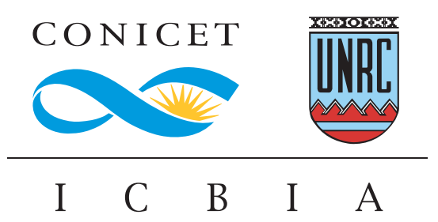
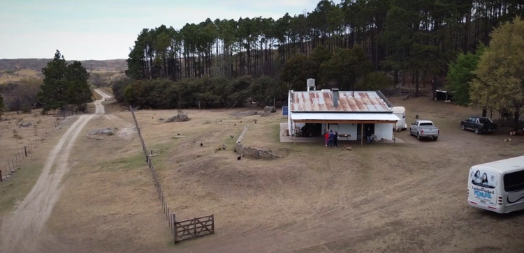
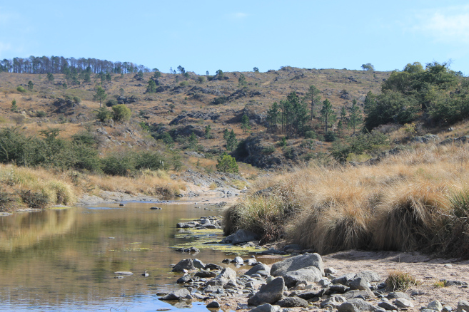
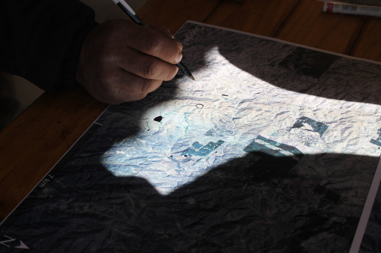
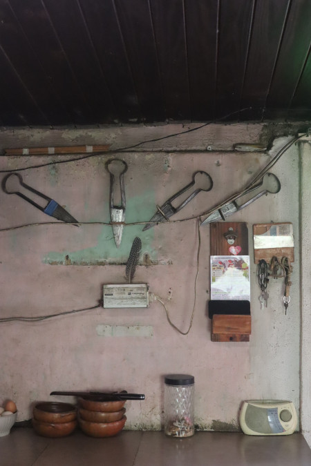
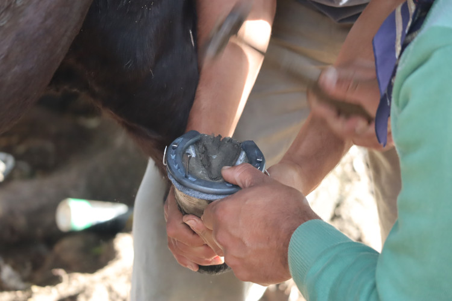
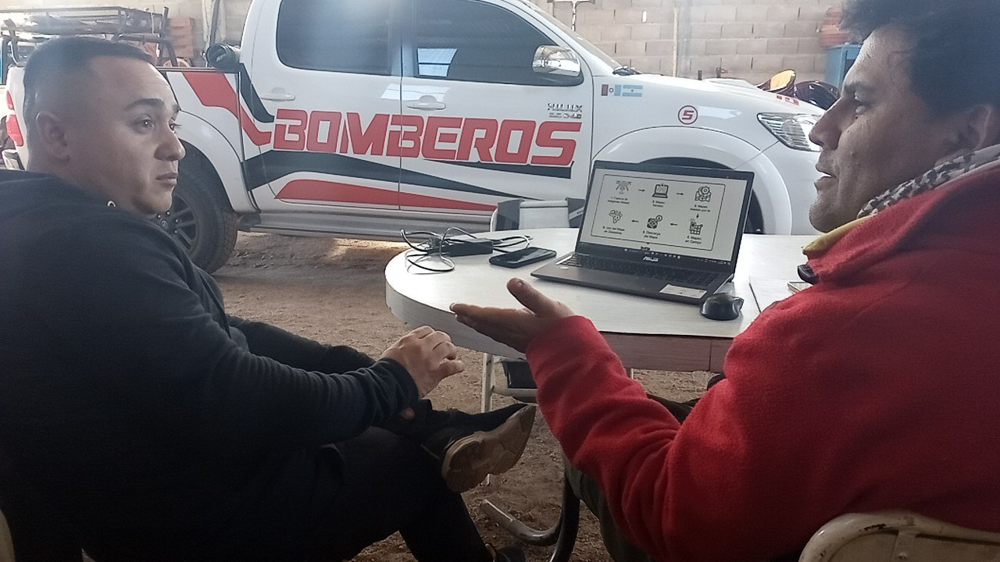

  09 de abril de 2025

#

Red comunitaria y científica de telecomunicaciones en Las Lagunitas, Alpa Corral y Río de los Sauces.  <b>La Universidad en el Territorio.</b>  by Daniel Bellomo bajo licencia <a href="https://creativecommons.org/licenses/by-sa/4.0/deed.es" target="_blank" rel="license noopener noreferrer" style="display:inline-block;">CC BY-SA 4.0</a>

 

# Ruralidad

- Campo Las Guindas (UNRC)
- Paraje Las Lagunitas
- La región: Cerro Colorado, Lutti, ...

### [el territorio](https://www.google.com/maps/d/u/0/embed?mid=1DnphT7VtOn-qKiffymB7TvGvUrhlbkg&ehbc=2E312F&ll=-32.59055739999999%2C-64.7146425&z=17)

# Conectividad desde los territorios

by [AlterMundi](https://altermundi.net)

### [serie de videos](https://www.youtube.com/watch?v=wMzQRt8HSJA&list=PL_Dpv4cu0bAq25HebGt6rDTz8wT3er_Oh)

# Espiral virtuoso

1. Las Guindas
1. familias del paraje
1. escuela rural
1. bomberos
1. ACTUA
1. CADEL
1. más familias
1. más instituciones
1. ...

# Las Guindas

Universidad Nacional de Río Cuarto

# Vínculo con las familias

construido mediante muchos años de trabajo de la Universidad en el territorio

- Guillermo Balboa (FAV)
- Nano D'eramo (Geología)
- Pepe Alonso (FAV)
- Fabián Zabala (FAV)

#

# La Comunidad

~~del anillo~~ de Las Lagunitas

# 

# Aprendiendo de la comunidad

# 

# 

#

# Familias del paraje 

Walter, Fabian, Joaquin, Noelia, Martina, Franco, Martin, Luciana, Gladys, Gonzalo, Patricio, Ale, Domingo, Eulalia, Julio, Maricel, Diego, Kika ...

(videos) 

# 

# 

 

# 

# Instituciones del territorio

- Escuela rural José Gabriel Brochero
- UNRC
- Asociación Civil Tierra Unida Activa (ACTUA)
- Coop Electricidad, internet y tel Alpa Corral 
- Bomberos Voluntarios
- ETAC
- Coop electricidad de Río de los Sauces
- Radioaficionados
- Municipalidades 

# Escuela rural

# 

# 

# ACTUA

- Titular de la licencia ["Valor Agregado Red Comunitaria" (VARC)](https://altermundi.net/como-solicitar-una-licencia-varc-de-redes-comunitarias/)
- Trabajo territorial
- Coordinación del proyecto y gestión de recursos

# 

# 

# CADEL

- Proveedor de acceso a Internet
- Infraestructura compartida
- Simbiosis

# Bomberos voluntarios

- detección temprana de incendios
- mapeo
- [taller de mapeo y simulacro](https://www.hotosm.org/updates/on-the-front-line-of-climate-change-end-to-end-open-mapping-tech-for-wildfires/)

# 

# 

 

# UNRC

- la "pata" científica de la red
- espacio para hacer ciencia en la ruralidad con foco en las flias que la habitan
- prácticas en el territorio
  - sociocomunitarias, profesionales, TP, tesis ...
  - computación, telecomunicaciones, energía solar, agronomía, meteorología, filosofía ...
- Instituto de Ciencias de la Tierra, Biodiversidad y Ambiente [(ICBIA)](https://icbia.conicet.gov.ar)
- Cátedra Libre de Soberanía Tecnológica [(CLiSTec)](https://clistec.libre.org.ar) en formación ... 

# 

- Programa para contingencias ante desastres naturales y mitigar los efectos del cambio climático en el paraje Las Lagunitas. (2023). Dir. Dr. José Raviolo (FAV)
- Red Comunitaria de internet rural. (2022). Dir. Dr. Lucio Pinotti (exactas)
- Red comunitaria de internet rural (2022). Dir. Carlos Rang (FAV)

# 

- Fortalecimiento de procesos de soberanía tecnológica y prácticas contributivas en el marco de la red comunitaria y científica de internet en el paraje Las Lagunitas y zonas aledañas (2024). Dir. Dra. Aldana D'Andrea (humanas)
- Caracterización epidemiológica de zoonosis parasitarias en caninos en zonas rurales de la región de las Sierra de los Comechingones, Dir. Dr. Carlos Motta (PPI)

#

# 

# 

# 

# 

# 2025

- [Desafía a tu Universidad (CyT UNRC)](https://www.unrc.edu.ar/unrc/cienciaytecnica/desafiaatuuni.php)
- [Grupo de energía Solar Ing UNRC](https://www.ing.unrc.edu.ar/grupos/ges/)
- [Emprendé ConCiencia (Fundación INVAP)](https://www.emprendeconciencia.org.ar)
- [Semana de la ciencia (C. Motta)](https://daniel.bellomo.ar/LLRCC/FAV-poster_semana_ciencia_2025.pdf)
- Ing. en Telecomunicacies (Prácticas Profesionales Supervisadas)

# Radioaficionados

repetidora VHF

# Gobernanza

Gobernanza de los bienes comunes. Elinor Ostrom “El gobierno de los bienes comunes”, 8 principios que permiten a las comunidades gestionar de manera sostenible los bienes comunes

[La Gobernanza de las Redes Comunitarias de Internet (guifi-net)](https://landing.guifi.net/es/la-gobernanza-de-las-redes-comunitarias-de-internet/)

# Vinculaciones con otras Instituciones 

- [AlterMundi (Jesica Giudice)](https://altermundi.net)
- [Vivero municipal de Alpa Corral (Natalia De Luca)](https://tierraunidaactiva.github.io/fotos/20240809_practicas_relevamiento_vegetacion.html)
- Univ. Nac. de San Luis (Alicia Molina)
- UBA antropología (Augusto Nuñez)
- Instituto Balseiro (Laila Kazimierski)
- Univ. Politécnica de Valencia (Pietro Manzoni)
- UBA Ing (Ignacio Hamelin)
- [Humanitarian OpenStreetMap Team (Celine Jacquin, Emilio Mariscal)](https://hotosm.org)
- guifi-net (Ramon Roca)
- ...

# mapa de la red

# ¡Llegó!

# ¡Muchas Gracias!

