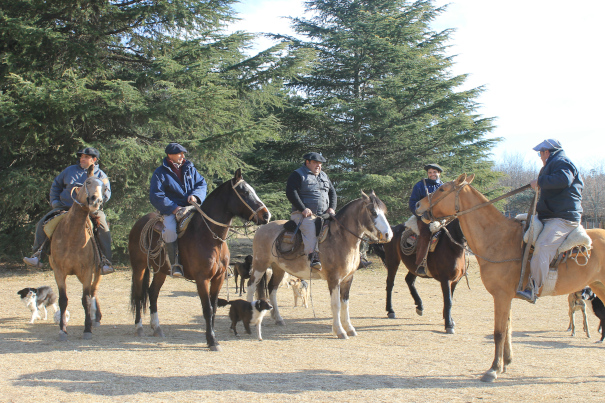
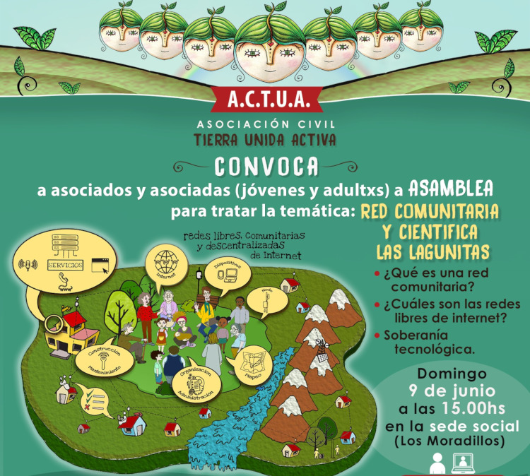
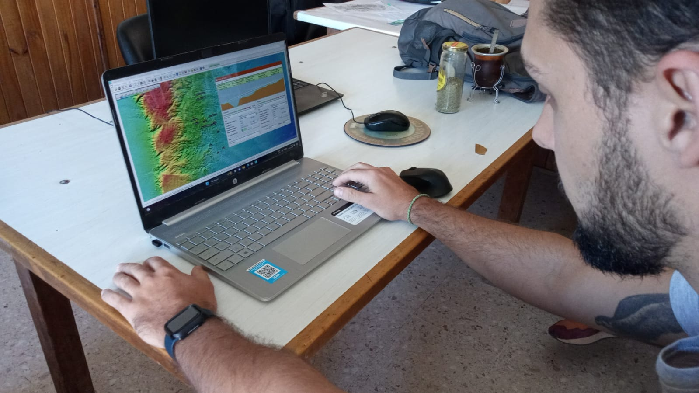

#

Las Lagunitas Red comunitaria y científica de telecomunicaciones   
<b><h2>Construyendo nuestro pedacito de Internet</b></h2>  
por Daniel Bellomo  
bajo licencia <a href="https://creativecommons.org/licenses/by-sa/4.0/deed.es" target="_blank" rel="license noopener noreferrer" style="display:inline-block;">CC BY-SA 4.0</a>

# 

**Conectividad Centrada en la Comunidad**

# Ruralidad

- Campo Las Guindas (UNRC)
- Paraje Las Lagunitas
- La región: Alpa Corral, Cerro Colorado, Lutti, ...
  

### [mapa del territorio](https://umap.hotosm.org/en/map/las-lagunitas_207#12/-32.5993/-64.6714)

# Conectividad desde los territorios

by [AlterMundi](https://altermundi.net)

### [serie de videos](https://www.youtube.com/watch?v=wMzQRt8HSJA&list=PL_Dpv4cu0bAq25HebGt6rDTz8wT3er_Oh)

# Espiral virtuoso

1. Las Guindas (UNRC)
1. familias del paraje
1. escuela rural
1. bomberos
1. ACTUA
1. CADEL
1. más familias
1. más instituciones
1. ...

# Las Guindas

Universidad Nacional de Río Cuarto

# Vínculo con las familias

construido mediante muchos años de trabajo de la Universidad en el territorio

- Guillermo Balboa (FAV)
- Nano D'eramo (Geología)
- Pepe Alonso (FAV)
- Fabián Zabala (FAV)
- Turco Sabanés (FAV)
- Torito Rang (FAV)
- ...

#

# La Comunidad

~~del anillo~~ de Las Lagunitas

# 

# Aprendiendo de la comunidad

# 

# 

#

# Familias del paraje 

Walter, Fabian, Joaquin, Noelia, Martina, Franco, Martin, Luciana, Gladys, Gonzalo, Patricio, Ale, Domingo, Eulalia, Julio, Maricel, Diego, Kika ...

# 

# 

 

# 

# Instituciones del territorio

- Escuela rural José Gabriel Brochero
- UNRC / ICBIA
- Asociación Civil Tierra Unida Activa (ACTUA)
- Coop Electricidad, internet y tel Alpa Corral 
- Bomberos Voluntarios
- Equipo Técnico de Acción ante Catástrofes (ETAC)
- Coop electricidad de Río de los Sauces
- Radioaficionados
- Municipalidades 

# Escuela rural

# 

taller de mapeo colaborativo con 5 escuelas rurales

# Tierra Unida Activa 

Asociación civil sin fines de lucro. Tiene como objetivo generar y promover el desarrollo integral de la comunidad de Alpa Corral y su zona de influencia

# ACTUA

- Titular de la licencia ["Valor Agregado Red Comunitaria" (VARC)](https://altermundi.net/como-solicitar-una-licencia-varc-de-redes-comunitarias/) (en trámite)
- Trabajo territorial
- Coordinación del proyecto 
- Gestión de recursos de la red

# 

# 

asamblea

# 

- Proveedor de acceso a Internet
- Infraestructura compartida
- Simbiosis

# Bomberos voluntarios

- detección temprana de incendios
- mapeo humanitario colaborativo
- [taller de mapeo y simulacro](https://www.hotosm.org/updates/on-the-front-line-of-climate-change-end-to-end-open-mapping-tech-for-wildfires/)

# 

# 

 

# UNRC

- la "pata" científica de la red
- espacio para hacer ciencia en la ruralidad con foco en las familias que la habitan
- prácticas en el territorio
  - sociocomunitarias, profesionales, TP, tesis ...
  - computación, telecomunicaciones, energía solar, agronomía, meteorología, filosofía ...
- Cátedra Libre de Soberanía Tecnológica [(CLiSTec)](https://clistec.libre.org.ar) en formación ... 

### Instituto de Ciencias de la Tierra, Biodiversidad y Ambiente (ICBIA)

 

https://icbia.conicet.gov.ar

# 

- Programa para contingencias ante desastres naturales y mitigar los efectos del cambio climático en el paraje Las Lagunitas. (2023). *Dir. Dr. José Raviolo* (FAV)
- Red Comunitaria de internet rural. (2022). *Dir. Dr. Lucio Pinotti* (exactas) (extensión)
- Red comunitaria de internet rural (2022). *Dir. Veterinario Carlos Rang* (FAV) (voluntariado universitario)

#

##### Gianni realizando las PPS

# 

# 

# 

# 

#

# Talleres de mapeo colaborativo

[1er encuentro](https://tierraunidaactiva.github.io/fotos/20240928_un_mapa_para_villa_el_chacay.html) / 
[2do encuentro](https://tierraunidaactiva.github.io/fotos/20241123_un_mapa_para_villa_el_chacay.html)

# 

# 2025

- [Desafía a tu Universidad (CyT UNRC)](https://www.unrc.edu.ar/unrc/cienciaytecnica/desafiaatuuni.php)
- [Grupo de energía Solar Ing UNRC](https://www.ing.unrc.edu.ar/grupos/ges/)
- [Semana de la ciencia (C. Motta)](https://daniel.bellomo.ar/LLRCC/FAV-poster_semana_ciencia_2025.pdf)
- Ing. en Telecomunicacies (Prácticas Profesionales Supervisadas)
- [Meshtastic](https://www.instagram.com/comunicacioningenieria/reel/DMqDne1spzn/)
- [mapeo humanitario colaborativo (HOT)](https://www.hotosm.org)
- [LiderCom](https://lidercom.net.ar)
- ...

#

- Fortalecimiento de procesos de soberanía tecnológica y prácticas contributivas en el marco de la red comunitaria y científica de internet en el paraje Las Lagunitas y zonas aledañas (2024). *Dir. Dra. Aldana D'Andrea* (Fac. humanas, proy. de ext)
- Caracterización epidemiológica de zoonosis parasitarias en caninos en zonas rurales de la región de las Sierra de los Comechingones, *Dir. Dr. Carlos Motta* (PPI)

#

#

Restauración ambiental integral
- *Ing. forestal Natalia De Luca*
- evaluación de la efectividad de técnicas de control de una especie exótica invasora del chaco serrano cordobés: Lantana Cámara

<audio controls src="audios/lantana_1.ogg"> </audio>
<audio controls src="audios/lantana_2.ogg"> </audio>

[fotos](https://tierraunidaactiva.github.io/fotos/20240809_practicas_relevamiento_vegetacion.html)

#

##### Fausto realizando las PPS

# 

# 

# Gobernanza

Gobernanza de los bienes comunes. Elinor Ostrom “El gobierno de los bienes comunes”, 8 principios que permiten a las comunidades gestionar de manera sostenible los bienes comunes

[La Gobernanza de las Redes Comunitarias de Internet (guifi-net)](https://landing.guifi.net/es/la-gobernanza-de-las-redes-comunitarias-de-internet/)

# Vinculaciones 

- [AlterMundi (Jesica Giudice)](https://altermundi.net)
- [Vivero municipal de Alpa Corral (Natalia De Luca)](https://tierraunidaactiva.github.io/fotos/20240809_practicas_relevamiento_vegetacion.html)
- Univ. Nac. de San Luis (Alicia Molina)
- UBA antropología (Augusto Nuñez)
- Instituto Balseiro (Laila Kazimierski)
- Univ. Politécnica de Valencia (Pietro Manzoni)
- UBA Ing (Ignacio Hamelin)
- [Humanitarian OpenStreetMap Team (Celine Jacquin, Emilio Mariscal)](https://hotosm.org)
- guifi-net (Ramon Roca)
- ...

#

# ¡Llegó!

https://commons.wikimedia.org/wiki/Category:Las_Lagunitas_Red_Comunitaria_y_Cient%C3%ADfica

# ¡Muchas Gracias!

